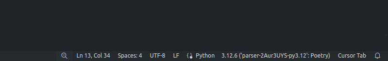

# parser

This project includes a parser for processing FE (Foundation Exam) exam PDFs and a development environment setup using Dev Containers.

## Running the Scraper

To run the scraper, use the following command:

```bash
python parser/scrape.py
```

Generated file exam_paths.json provides path information for each stored exam file.

## Running the Parser

To run the parser, use the following command:

```bash
python parser/parse.py <path to FE pdf>
```

After running the parser, open `document.json` to view the parsed questions.

## Development Environment Setup

This project uses Dev Containers to provide a consistent development environment. There are two configurations available: a base setup and a CUDA-enabled setup.

### Base Dev Container

The base dev container is defined in `.devcontainer/devcontainer.json` and includes the following features:

- **Python 3.12** with tools like `flake8`, `autopep8`, `black`, `yapf`, `mypy`, `pydocstyle`, `pycodestyle`, `bandit`, `pipenv`, `virtualenv`, `pytest`, `pylint`, `poetry`, and `ruff`.
- **Git LFS** for handling large files.

#### VSCode Extensions

The base dev container also includes the following VSCode extensions:

- Conventional Commits
- Ruff
- Jupyter
- Python
- Python Indent

### CUDA Dev Container

The CUDA dev container is defined in `.devcontainer/cuda/devcontainer.json` and includes all the features of the base container, plus:

- **NVIDIA CUDA** with support for CUDA version 12.2+.

If you don't know what version of CUDA you have, you can check by running `nvidia-smi`. If nothing shows up, you need to install CUDA.

#### Host Requirements

- A CUDA-enabled Nvidia GPU.
- Nvidia Driver. You can install it by following the instructions [here](https://www.nvidia.com/Download/index.aspx).
- The NVIDIA Container Toolkit. You can install it by following the instructions [here](https://docs.nvidia.com/datacenter/cloud-native/container-toolkit/install-guide.html).
- The CUDA Toolkit. You can install it by following the instructions [here](https://developer.nvidia.com/cuda-downloads).

If you are running WSL2, checkout [this](https://docs.docker.com/desktop/gpu/#using-nvidia-gpus-with-wsl2) and [this](https://docs.nvidia.com/cuda/wsl-user-guide/index.html).

### Using the Dev Containers

To use the dev containers, follow these steps:

1. **Install Prerequisites**:
   - Ensure you have Docker installed on your machine.
   - Install [Visual Studio Code (VSCode)](https://code.visualstudio.com/) and the [Remote - Containers extension](https://marketplace.visualstudio.com/items?itemName=ms-vscode-remote.remote-containers).

2. **Open the Project in VSCode**:
   - Launch VSCode and open the project folder.

3. **Select a Dev Container Configuration**:
   - Click on the green icon in the bottom-left corner of VSCode (or press `F1` and type `Dev Containers: Open Folder in Container...`).
   - Choose the desired dev container configuration from the list. You can select either the base setup or the CUDA-enabled setup (if you have an NVIDIA GPU).

4. **Start the Development Environment**:
   - VSCode will build and start the selected dev container. This may take a few minutes the first time as it downloads necessary images and sets up the environment.

5. **Switching Between Dev Containers**:
   - To switch between the base and CUDA dev containers, repeat step 3 and select the other configuration.
   - VSCode will rebuild and restart the environment with the new configuration.

### Python Virtual Environment

In VSCode, open any python file and at the bottom right of your screen you should see the python environment being used, see screenshot below:



On your side, click the button that is in the place of where it says "3.12.6" on my screenshot. Select the python virtual environment that includes the word `.venv`.

See below for an example (may not be exactly the same):


## Common Issues

### Permission denied

If you get a permission denied error, you will need to update the owner of the file to the user in the container.

From within the container, run the following command:
```
sudo chown -R vscode:vscode /workspace/parser
```